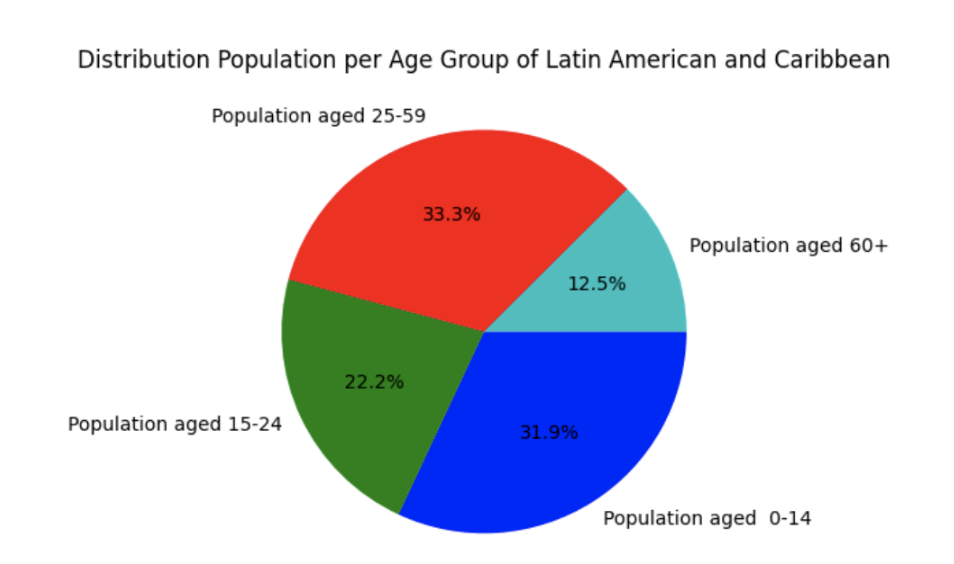
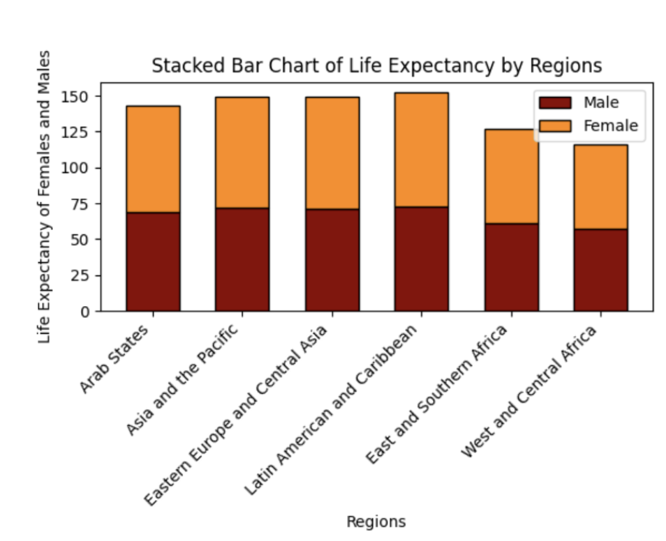
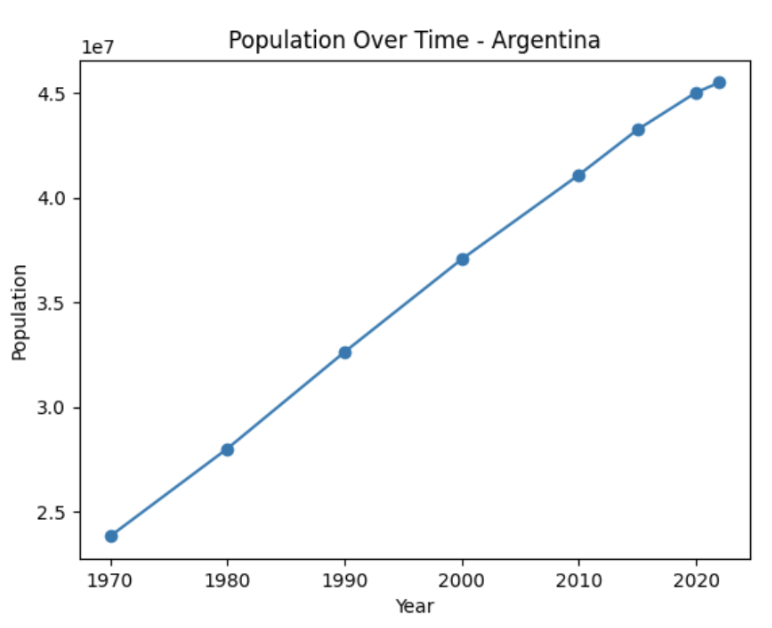

# InsightGRAPHIX – Data Visualisation App

## Project Overview
InsightGRAPHIX is a Python-based application that provides interactive visualisations of demographic, human capital, and world population data.  
The tool allows users to explore regions and countries through graphical menus and generates plots such as:

- Population age distribution (pie chart)  
- Education enrollment rates (stacked bar chart)  
- Life expectancy by gender (stacked bar chart)  
- Total population by region (bar chart)  
- Population growth over time (line chart)  

This project was developed as part of a business and data analysis challenge to support market expansion strategies by providing comparative insights between regions and countries.
Check the report for more in detial explanation.

---

## Project Structure

```text
data-visualisation-app/
│
├── program.py                # Main application code
├── main.py                   # main function
├── requirements.txt          # Python dependencies
├── demographics.xlsx         # Dataset on demographic indicators
├── humancapital.xlsx         # Dataset on human capital indicators
├── world_population.csv      # Dataset on population evolution
└── README.md                 # Documentation
```

---

## Installation

1. **Clone the repository**
   ```bash
   git clone https://github.com/pilarguerreromorales/data-visualisation-app.git
   cd data-visualisation-app
   ```

2. **Create and activate a virtual environment (recommended)**
   ```bash
   python3 -m venv venv
   # macOS/Linux
   source venv/bin/activate
   # Windows (PowerShell)
   venv\Scripts\Activate.ps1
   # Windows (CMD)
   venv\Scripts\activate
   ```

3. **Install dependencies**
   ```bash
   pip install -r requirements.txt
   ```

---

## Usage

Run the main program with:
```bash
python program.py
```

This will open a graphical interface window where you can:

- Click **START** to begin  
- Select either **Regional plots** or **Country-specific population growth**  
- Navigate through menus to generate visualisations of your choice  
- Go back to the main menu or quit at any time

---

## Example Visualisations

Here are examples of different charts generated by the app:

### Population Distribution (Pie Chart)


### Life Expectancy by Regions (Stacked Bar Chart)


### Population Growth Over Time (Line Chart)


---

## Requirements

The project depends on the following key Python packages:

- `pandas`  
- `matplotlib`  
- `openpyxl`  
- `graphics.py`

The full dependency list is included in `requirements.txt`.

---

## Data Sources

- UNFPA State of World Population Data 2023  
- Kaggle: World Population Dataset

---

## Authors

- Pilar Guerrero  
- Emilia Granja  
- Alexía Chacón  
- Tessa Correig
